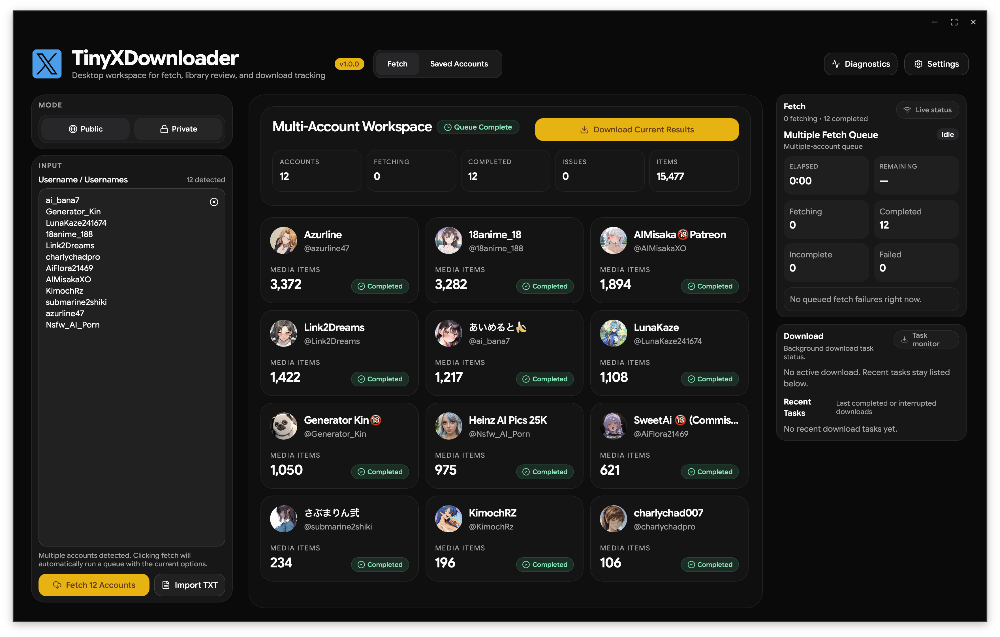

# TinyXDownloader

TinyXDownloader is a desktop-first X/Twitter media fetch and download workspace built with Wails, React, and Go. This local fork focuses on a clean operator workflow for batch fetching, saved account review, background downloads, and macOS packaging.

## Latest Workspace



The current UI is organized into three persistent work areas:

- a left fetch control rail for public/private mode selection and single-or-multi account input
- a central workspace for live fetch results, multi-account queue progress, and saved media browsing
- a right activity rail for fetch status and background download monitoring

Settings and Diagnostics open as right-side drawers so the main workspace stays focused on fetch and library tasks.

## Key Capabilities

- Fetch public media, private likes, and private bookmarks from a single desktop workflow.
- Fetch public media, public timelines/date ranges, private likes, and private bookmarks through the same Go-only desktop runtime.
- Paste one account or many accounts into the same input box, separated by newline or Enter.
- Run multi-account fetch queues with a dedicated workspace and one-click download for the current fetched set.
- Resume interrupted fetches and use incremental refresh instead of re-fetching the full timeline every time.
- Review saved accounts in-app, search and filter the library, and launch downloads from saved data.
- Monitor fetch and download progress from the right activity rail while work continues in the background.
- Package the app as a local `.app`, `.zip`, and `.dmg` for macOS arm64.

## Documentation

- [Workspace Overview](docs/workspace-overview.md)
- [Performance Plan / Implementation Notes](docs/plan.md)
- [Bookmarks Cleanup Guide](docs/bookmarks-cleanup.md)

## Bookmarks Tooling

The repo includes a local bookmarks cleanup toolchain for your own authenticated X session. The shortest path is:

```bash
./bookmarks.sh export-cookies --name auth_token --name ct0 --name twid --pretty
./bookmarks.sh dry-run --expected-handle Tiny_MOD
./bookmarks.sh clear --headless
```

By default this writes `chrome-x-cookies.json` at the repo root and saves `before` / `after` / `error` screenshots under `tmp/bookmarks/`. The longer walkthrough and safety notes live in [Bookmarks Cleanup Guide](docs/bookmarks-cleanup.md).

## Local Build

### Prerequisites

- Go
- Node.js with pnpm
- macOS if you want `.app`, `.zip`, or `.dmg` release artifacts

### Bootstrap a clean checkout

```bash
./bootstrap.sh
```

This prepares the project from source:

- installs frontend dependencies
- prepares the go-only extractor runtime
- generates `frontend/wailsjs`

### Run in development mode

```bash
./dev.sh
```

### Build the desktop app

```bash
./build.sh
```

This produces the local app bundle at:

```text
build/bin/TinyXDownloader.app
```

## macOS Release Packaging

Build the macOS arm64 release artifacts with:

```bash
./build-macos.sh
```

This produces:

```text
build/bin/TinyXDownloader.app
build/release/TinyXDownloader-v{version}-macos-arm64.zip
build/release/TinyXDownloader-v{version}-macos-arm64.dmg
build/release/SHA256SUMS.txt
```

## Signing and Notarization Preparation

`build-macos.sh` supports two release modes:

- local distribution mode: builds an ad-hoc signed `.app`, `.zip`, and `.dmg`
- full release mode: signs, notarizes, and staples the app when Apple credentials are available

To enable the full signing pipeline, provide all three variables together:

```bash
export MACOS_SIGN_IDENTITY="Developer ID Application: Your Name (TEAMID)"
export MACOS_TEAM_ID="TEAMID"
export MACOS_NOTARY_PROFILE="tinyxdownloader-notary"
./build-macos.sh
```

Before using `MACOS_NOTARY_PROFILE`, create the keychain profile once on the build machine:

```bash
xcrun notarytool store-credentials "tinyxdownloader-notary" \
  --apple-id "you@example.com" \
  --team-id "TEAMID" \
  --password "app-specific-password"
```

After a signed release build, verify the notarized app with:

```bash
codesign --verify --deep --strict build/bin/TinyXDownloader.app
spctl -a -vv build/bin/TinyXDownloader.app
xcrun stapler validate build/bin/TinyXDownloader.app
```

## App Data Root

Runtime state now lives under an app-data root that can be overridden for smoke tests, CI, or isolated local runs.

- default root: `~/.twitterxmediabatchdownloader`
- override env: `XDOWNLOADER_APPDATA_DIR`

The following files/directories are derived from that root:

- `accounts.db`
- `auth_tokens.json`
- `logs/`
- managed `ffmpeg`
- managed `exiftool`

Example:

```bash
XDOWNLOADER_APPDATA_DIR="$(mktemp -d)" ./build/bin/TinyXDownloader.app/Contents/MacOS/TinyXDownloader
```

## Diagnostics and Backups

Diagnostics now use a dual path:

- the in-app diagnostics panel still shows the current session log stream
- frontend and backend diagnostic logs are also written to persistent files under `logs/`

Persistent diagnostic logs rotate automatically so the app-data directory does not grow without bound. Support bundles intentionally include only the most recent tail of each log file instead of the full unbounded history.

The Diagnostics drawer now includes native actions for:

- exporting a support bundle
- creating a database backup
- restoring a database backup
- opening the app-data folder

Support bundles exclude raw `auth_tokens.json`, managed binaries, and downloaded media payloads. Database backups include `accounts.db` plus a manifest with schema and checksum metadata so restores can validate compatibility before replacing local state.

## Desktop Smoke

Run the real macOS app in smoke mode with deterministic fetch/download/integrity providers:

```bash
./scripts/desktop-smoke.sh
```

This script:

- builds the real `.app`
- seeds a temporary app-data directory with the saved-accounts test database
- launches the Wails app with `XDOWNLOADER_SMOKE_MODE=1`
- waits for `report.json`
- captures failure artifacts under `build/desktop-smoke/`

The smoke runner uses these env vars:

```bash
XDOWNLOADER_SMOKE_MODE=1
XDOWNLOADER_SMOKE_REPORT_PATH=/abs/path/report.json
XDOWNLOADER_APPDATA_DIR=/abs/path/tmp-appdata
```

## Self-Hosted macOS Runner Prep

Desktop smoke, signed release builds, notarization, and GitHub Release publishing are designed to run on a self-hosted macOS runner labeled:

```text
self-hosted, macOS, xdownloader-macos
```

That runner should already have:

- Xcode Command Line Tools
- Go
- Node.js + pnpm
- a Developer ID Application certificate in the login keychain
- a stored notary profile created with `xcrun notarytool store-credentials`

The release workflow reads these repo variables:

```text
MACOS_SIGN_IDENTITY
MACOS_TEAM_ID
MACOS_NOTARY_PROFILE
```

CI and release packaging are now go-only. Python, gallery-dl, and the legacy helper are no longer part of the build or runtime path.

## GitHub Actions

Two workflows are expected on the mainline:

- `ci`: backend tests, frontend lint/test/build/browser smoke, plus self-hosted desktop smoke
- `release`: tag-driven signed build, notarization, desktop smoke, and GitHub Release upload

The release workflow publishes:

- `TinyXDownloader-v{version}-macos-arm64.zip`
- `TinyXDownloader-v{version}-macos-arm64.dmg`
- `SHA256SUMS.txt`

## Extractor Runtime

The extractor runtime is now Go-only for the five supported user-visible families:

- public `media`
- public `timeline`, `tweets`, and `with_replies`
- public `date_range`
- private `likes`
- private `bookmarks`

`XDOWNLOADER_EXTRACTOR_ENGINE=go`, `auto`, `python`, or unset all resolve to the same Go-only runtime. The `python` value is kept only as a deprecated compatibility alias so older environments do not crash on startup.

Historical rollout, parity, validation, live-validation, and soak evidence are still preserved in app data and support bundles for audit and cutover review, but they no longer control routing in the current app version.
