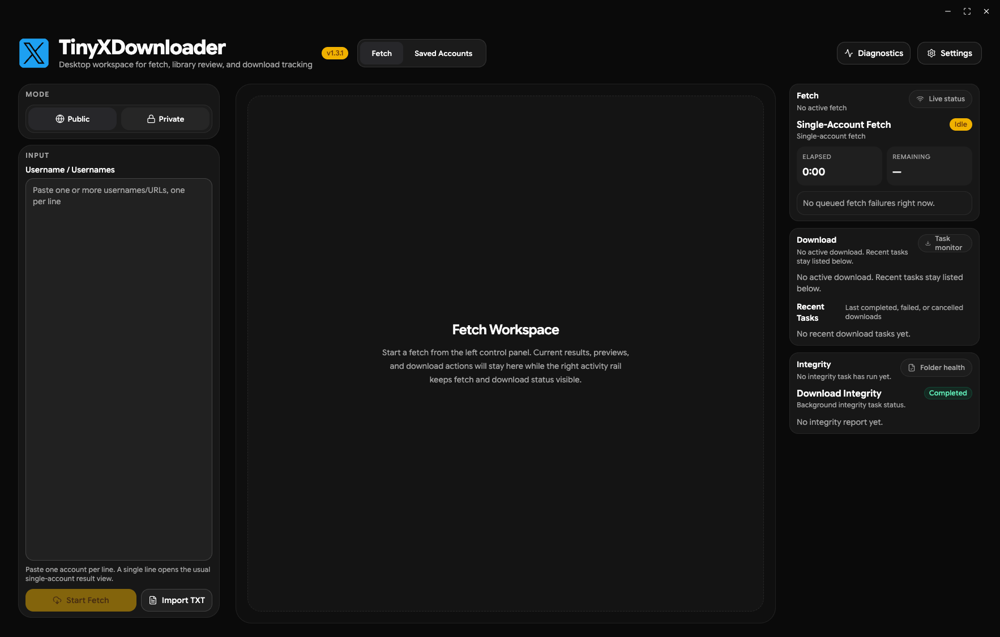

# Workspace Overview

## Summary

TinyXDownloader is organized as a single desktop workspace instead of a page-heavy navigation model. The goal is to keep fetch, review, and download actions visible at the same time, while moving lower-frequency controls such as Settings and Diagnostics into drawers.

## Layout

### Left rail

The left rail is the fetch control area.

- `Mode` switches between `Public` and `Private`.
- `Input` accepts one or many usernames in the same field.
- Multiple public accounts can be pasted at once, separated by newline or Enter.
- The fetch button automatically routes into the multi-account queue when multiple public accounts are detected.

Auth token configuration and advanced options were intentionally moved out of this rail and into `Settings` so the input area can use the full vertical space.

### Center workspace

The center panel changes with the current task:

- Single-account fetch shows live results directly.
- Multi-account fetch shows a queue-focused workspace with status cards for each account.
- Saved media review opens the library and media list views.

For multi-account fetch, the workspace is designed as an operational dashboard rather than a blank placeholder:

- queue summary metrics stay at the top
- account cards show avatar, name, username, item count, and status
- one download action is provided for the current fetched result set

### Right rail

The right rail is now a persistent activity surface instead of a tab switcher.

- `Fetch` status stays on top
- `Download` status stays below it
- background tasks remain visible while the center workspace changes

This keeps long-running operations observable without forcing navigation away from the current workspace.

## Settings And Diagnostics

`Settings` and `Diagnostics` open as right-side drawers.

- They no longer consume a full page in the main workspace.
- Drawer content now starts from the top instead of wasting vertical space with a header divider.
- Settings includes fetch-related controls such as auth tokens and default fetch options.
- Diagnostics provides log viewing, copy, and clear actions without leaving the main workspace.

## Fetch Model

### Shared account input

Single-account and multi-account public fetch now share the same input model.

- one username behaves like a normal single-account fetch
- multiple usernames automatically create a multi-account queue
- no separate single/multi mode switch is required

### Incremental refresh

The app now treats a previously completed snapshot as the overlap boundary for later refreshes.

- first fetch for a scope is full
- later fetches stop early when saved items are encountered
- interrupted sessions can still be resumed with cursor-based recovery

## Saved Accounts

Saved Accounts remains a full-library view rather than a paged remote browser.

- search, grouping, sorting, and download actions stay available
- recent and saved account workflows remain local-first
- background downloads reuse saved snapshots directly instead of rebuilding large payloads in the frontend

## Performance Direction

The current workspace is backed by the newer performance-oriented architecture:

- structured fetch responses instead of stringified hot-path payloads
- append-only timeline accumulation during fetch
- snapshot storage backed by summary plus timeline item records
- code-split heavy panels such as Saved Accounts, Media List, Settings, and Diagnostics
- adaptive download worker selection for image-heavy versus video-heavy batches

That combination keeps the UI focused on fetch and download work while pushing more of the heavy lifting closer to the backend, network, and disk where it belongs.
